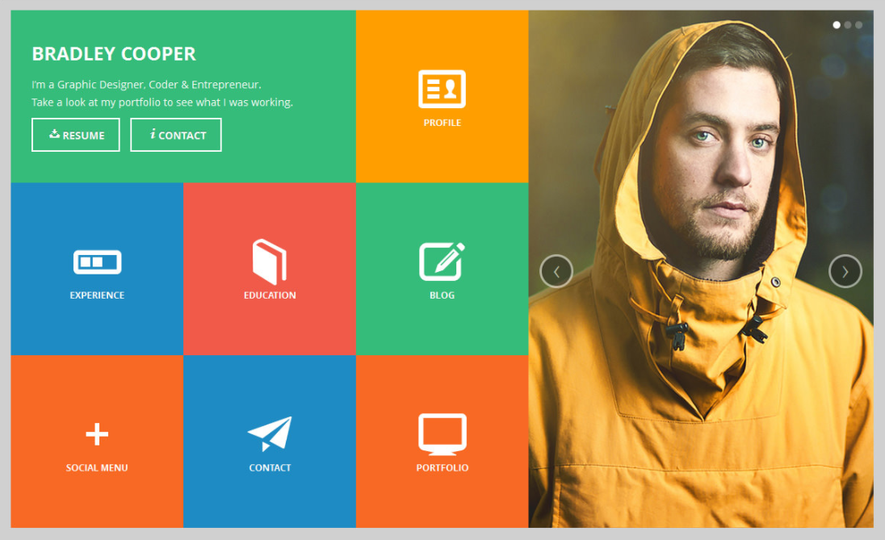
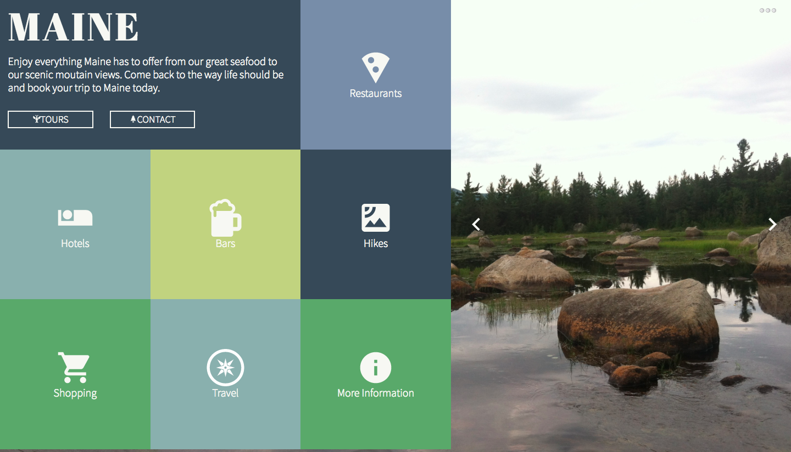

# jdursema.github.io

This website is my first static comp project at Turing. Our instructors gave us the following layout:

We were required to recreate the comp without changing the layout, however, we did have creative liscense when it came to the icons, colors, text, and images. 

Using flexbox for the first time, I created the below webpage about my home state:

